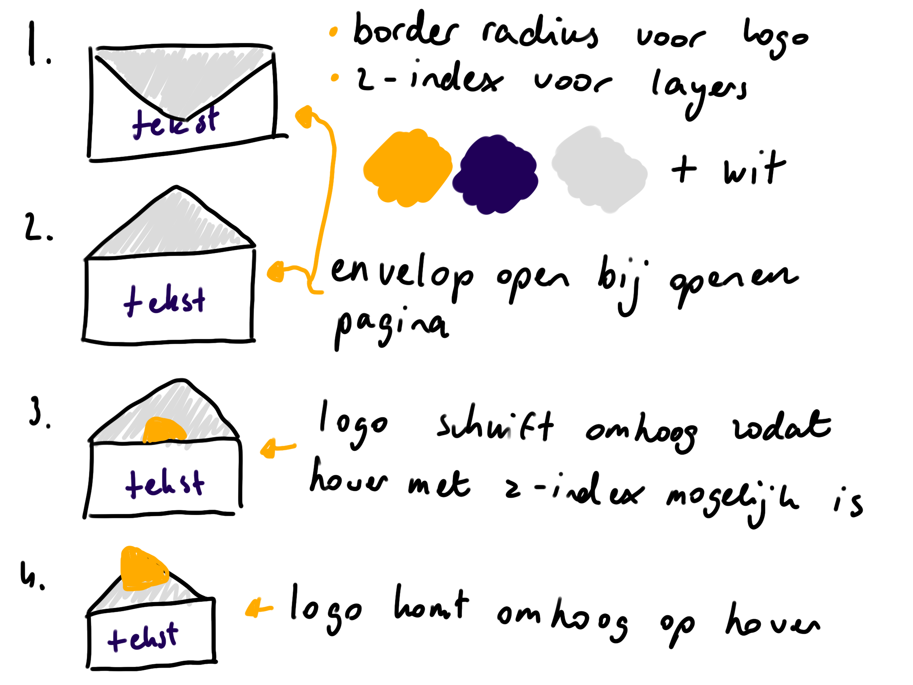
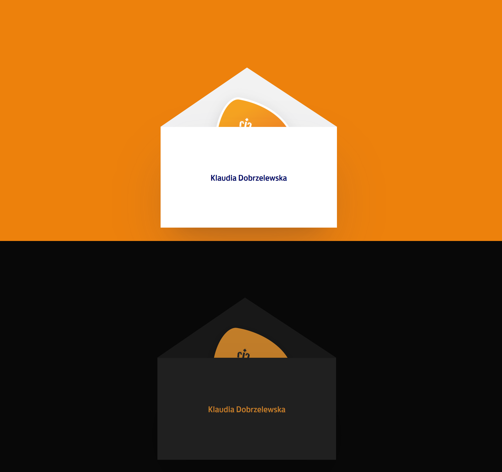
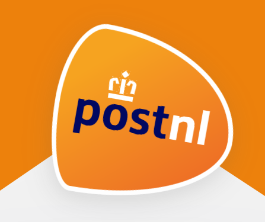
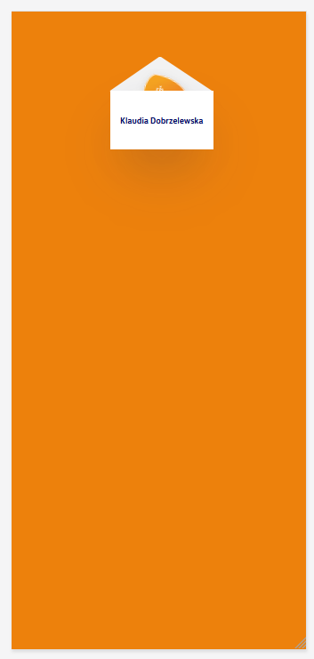
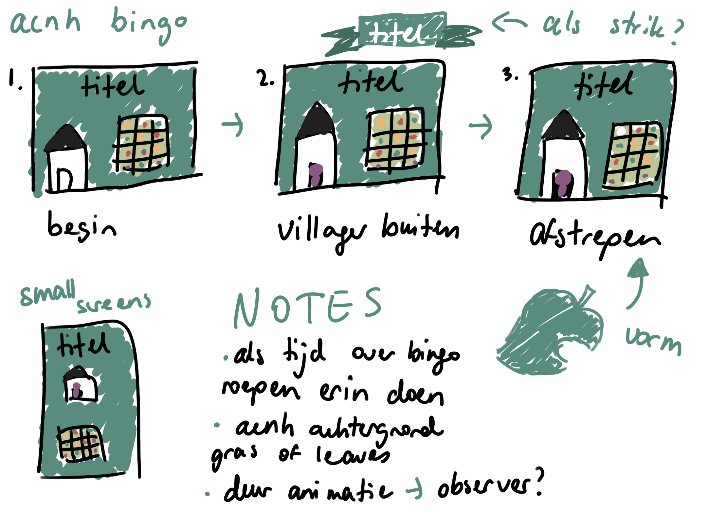

# Procesverslag
**Auteur:** Klaudia Dobrzelewska

**De opdrachten:** [opdracht 1](opdracht1/index.html) en [opdracht 2](opdracht2/index.html)

Markdown is een simpele manier om HTML te schrijven.  
Markdown cheat cheet: [Hulp bij het schrijven van Markdown](https://github.com/adam-p/markdown-here/wiki/Markdown-Cheatsheet).

Nb. De standaardstructuur en de spartaanse opmaak van de README.md zijn helemaal prima. Het gaat om de inhoud van je procesverslag. Besteedt de tijd voor pracht en praal aan je website.

Nb. Door *open* toe te voegen aan een *details* element kun je deze standaard open zetten. Fijn om dat steeds voor de relevante stuk(ken) te doen.

## Bronnenlijst
  1. Logo, kleurschema (dark+light) en font van opdracht 1: https://www.postnl.nl/
  2. Border-radius generator, opdracht 1: https://9elements.github.io/fancy-border-radius/ 
  3. Clip-path generator, opdracht 1 en 2: https://bennettfeely.com/clippy/ 
  4. Achtergrond voor binnenkant van het huis, opdracht 2: https://nl.pinterest.com/pin/414683078192970052/ 
  5. Buitenkant van het huis, opdracht 2: https://animalcrossingworld.com/guides/new-horizons/villager-house-exterior-designs-complete-list/
  6. Originele foto van het achtergrond, ik heb hem zelf wel scherper gemaakt in Illustrator, opdracht 2: https://www.animal-crossing.com/new-horizons/ 
  7. Array shuffle, opdracht 2: https://www.w3docs.com/snippets/javascript/how-to-randomize-shuffle-a-javascript-array.html  
  8. Slice in de shuffle, opdracht 2: https://developer.mozilla.org/en-US/docs/Web/JavaScript/Reference/Global_Objects/Array/slice
  9. Basis van API in HTML doen, opdracht 2: https://codepen.io/shooft/pen/OJovVev  
  10. Tutorial voor observer, opdracht 2: https://www.youtube.com/watch?v=_5Bu3JY-ZHc 
  11. Animal Crossing leaf voor de afvink overlay, opdracht 2: https://commons.wikimedia.org/wiki/File:Animal_Crossing_Leaf.svg 

## Opdracht 1 plan

  
uitwerken na schetsen idee (voor week 2)

  ### Je storyboard:
  

  ### Je ambitie: 
  Aan deze technieken/punten wil ik werken:
  - Ik wil graag leren om een mooie, professionele animatie te maken.
  - Ik wil meer experimenteren met de bezier mogelijkheden binnen de animaties.
  - Ik wil iets maken waar ik trots op ben.
  - Ik wil responsiviteit onder de knie krijgen.

## Opdracht 1 reflectie

  
uitwerken bij afronden opdracht (voor week 4)

  ### Je uitkomst - karakteristiek screenshot(s):
  

  ### Dit ging goed/Heb ik geleerd: 
  Korte omschrijving met plaatje(s)
  - De logo namaken door middel van border-radius, gradient en clip-path was nieuw voor mij, maar is wel goed gegaan.
  - Gebruik maken van @font-face was nieuw, maar het ging goed.
  - Geleerd hoe je een driehoek maakt door middel van borders.
  - Voor het eerst een gradient gebruiken.
  - Dark-mode ging goed.
  - Reduced motion ging goed.
  - Custom properties gingen goed.

  

  ### Dit was lastig/Is niet gelukt:
  Korte omschrijving met plaatje(s)
  - CSS coderen op basis van ontzettend simpele HTML code was een uitdaging.
  - Clip-path gebruiken om echt wat te tekenen was lastig.
  - Responsiviteit ging moeizaam.

  

## Opdracht 2 plan

  
uitwerken na schetsen idee (voor week 5)

  ### Je ontwerp:
  

  ### Je ambitie: 
  Aan deze technieken/punten wil ik werken:
  - Ik wil beter worden in Javascript in het algemeen.
  - Ik wil nieuwe Javascript functies leren.
  - Ik wil begrijpen wat er in de Javascript code staat.
  - Ik wil responsiviteit in een keer goed doen.
  - Ik wil zorgen voor een opmaak die past bij Animal Crossing.
  - Ik wil iets maken waar ik trots op ben.

## Opdracht 2 test

  
uitwerken na testen (week 7)

  De test heb ik later uitgevoerd, omdat ik met deze opdracht een beetje uitliep.

  Neem minimaal 5 bevindingen op:

  ### Bevinding 1:
  Responsiviteit is nog niet goed.
    

  #### oplossing:
  De responsiviteit was niet goed, omdat ik op een groot scherm begon in plaats van een kleine. Ik heb de CSS herschreven en nu is de responsiviteit wel goed.
  FOTO TOEVOEGEN!!!!

  ### Bevinding 2:
  De villager uit het huisje oproepen gaat nog mis.
    

  #### oplossing:
  Sanne heeft de functie voor mij verbeterd, waardoor het oproepen nu goed gaat.
  FOTO TOEVOEGEN!!!!!

  ### Bevinding 3:
  Nog niet overal toetsenbord bediening. Het huisje dat als button dient heeft hier vooral last van.
   

  #### oplossing:
  De img van het huisje dat de knop is plaatsen binnen een button, dan kan je het selecteren met tab, net zoals de rest van de elementen op de pagina.
    

  ### Bevinding 4:
  If else code werkt nog niet.
    

  #### oplossing:
  If else was onnodig. Sanne heeft mij geholpen en de gebruikte functie voor mij verbeterd, waardoor de button werkt zonder if else statement.
    

  ### Bevinding 5:
  Op kleinere schermen staat het bingo bord scheef.
    

  #### oplossing:
  Ik heb hier samen met Sanne naar gekeken en het probleem was de padding. Nu deze weg is, staat het bingo bord goed.
  FOTO TOEVOEGEN!!!!

  ### Bevinding 6:
  Nog geen hover, focus en active states op de interactieve elementen.
  FOTO TOEVOEGEN!!!!

  #### oplossing:
  Ik heb al deze states nu toegevoegd. 
  FOTO'S TOEVOEGEN!!!!

## Opdracht 2 reflectie

  
uitwerken bij afronden opdracht (voor week 8)

  ### Je uitkomst - karakteristiek screenshot(s):
  

  ### Dit ging goed/Heb ik geleerd: 
  Korte omschrijving met plaatje(s)

  

  ### Dit was lastig/Is niet gelukt:
  Korte omschrijving met plaatje(s)

  

